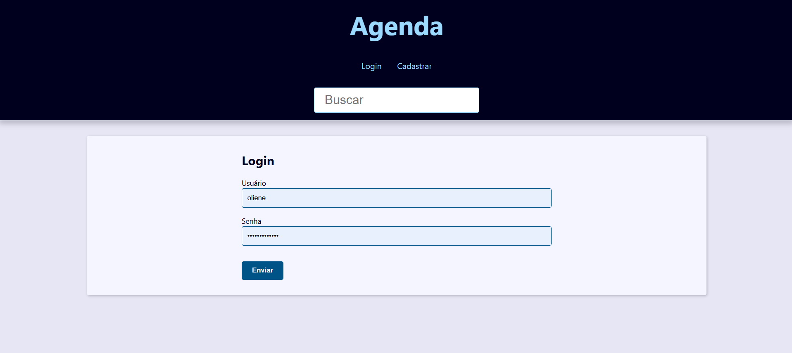
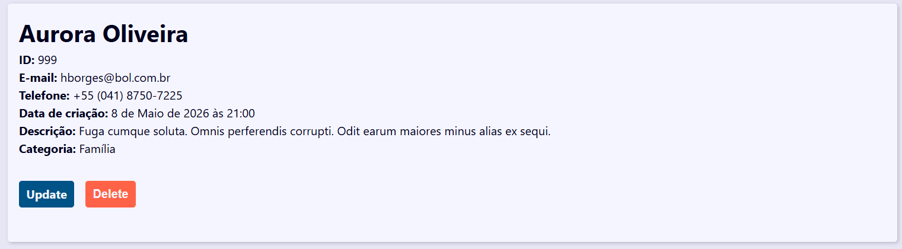
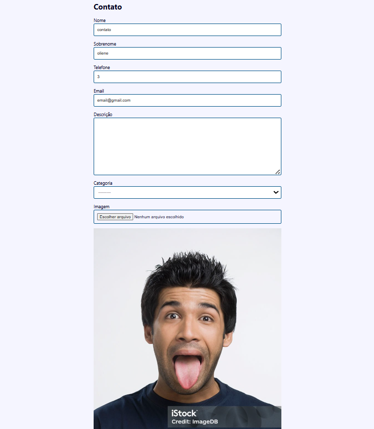

# 📒 Agenda de Contatos

Uma aplicação web desenvolvida com **Django** para gerenciamento de contatos. O sistema permite que usuários se cadastrem, façam login e gerenciem seus próprios contatos de forma segura, com controle de permissões e organização por categorias.

---

## ✨ Funcionalidades

- 👤 Cadastro de usuários
- 🔐 Login e logout
- ✏️ Atualização de perfil
- ➕ Cadastro de contatos
- 📝 Edição de contatos
- 🗑️ Exclusão de contatos
- 📋 Visualização dos detalhes de um contato
- 🖼️ Upload de imagem para os contatos
- 📂 Organização por categorias
- 🔎 Pesquisa de contatos
- 📄 Paginação da lista de contatos
- 🔒 Usuários visualizam apenas os próprios contatos
- 👑 Superusuário pode visualizar, editar e excluir qualquer contato

---

## 🛠 Tecnologias utilizadas

- Python 3
- Django
- SQLite
- HTML5
- CSS3
- Pillow

---

## 🚀 Como executar o projeto

### 1. Clone o repositório

```bash
git clone https://github.com/SEU-USUARIO/Projeto_Agenda.git
```

### 2. Entre na pasta do projeto

```bash
cd Projeto_Agenda
```

### 3. Crie um ambiente virtual

Windows

```bash
python -m venv venv
```

Linux/macOS

```bash
python3 -m venv venv
```

### 4. Ative o ambiente virtual

Windows

```bash
venv\Scripts\activate
```

Linux/macOS

```bash
source venv/bin/activate
```

### 5. Instale as dependências

```bash
pip install -r requirements.txt
```

### 6. Execute as migrações

```bash
python manage.py migrate
```

### 7. Inicie o servidor

```bash
python manage.py runserver
```

A aplicação estará disponível em:

```
http://127.0.0.1:8000/
```

---

## 📸 Capturas de tela

### Página inicial


### Login



### Detalhe de contato



### Editar contato



---


## 📚 Conceitos praticados

Durante o desenvolvimento deste projeto foram utilizados conceitos importantes do Django, como:

- Models
- Views
- Templates
- URLs
- Forms e ModelForms
- Upload de arquivos
- Relacionamentos entre modelos
- Paginação
- Sistema de autenticação
- Controle de permissões
- CRUD completo
- Organização de aplicações Django

---

GitHub: https://github.com/Wefrit